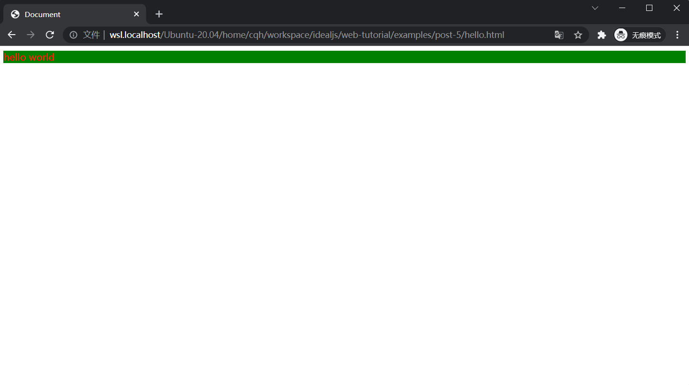

# CSS3 快速入门

上一节，入门了 HTML5。了解了 HTML5 的 Hello World 后，我们可以开始学习 CSS3 了。

目标很简单，给 Hello World 加上一个颜色，并且再加一个背景色。

本篇的完整代码，可以在这里找到：

- [examples/post-5/hello.html](https://github.com/idealjs/full-stack-tutorial/blob/main/examples/post-5/hello.html)

## 查看这个网页

查看这个 Hello World 很简单，只需要把这个 hello.html 文件下载到计算机。然后用浏览器打开就可以了。



## 简单分析代码

```html
<!DOCTYPE html>
<html lang="en">
  <head>
    <meta charset="UTF-8" />
    <meta http-equiv="X-UA-Compatible" content="IE=edge" />
    <meta name="viewport" content="width=device-width, initial-scale=1.0" />
    <title>Document</title>
  </head>
  <body>
    <div style="color: red; background-color: green">hello world</div>
  </body>
</html>
```

和上一节有区别的地方在于

```
<div style="color: red; background-color: green">hello world</div>
```

多了一组 style 属性，`style="color: red; background-color: green"`

其中的 `color` `bacogound-color` 是 CSS3 的属性，`red` `green` 值。并且需要用 `;` 分隔。

可以参考下图片


这里我们只展示了 CSS3 的一种写法。未来为大家介绍更多的写法。
